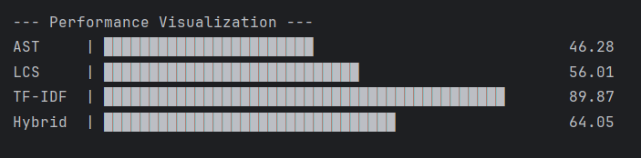

# Advanced Code Plagiarism Detection Framework

## Project Overview
This project is a high-performance Java framework designed to identify source code plagiarism by comparing structural and semantic similarities. It leverages multiple detection strategies to provide a comprehensive analysis of code authenticity.

## Core Methodology
The system integrates four distinct algorithms to detect different forms of code manipulation:
- **AST (Abstract Syntax Tree)**: Analyzes structural syntax to detect logical similarities despite variable renaming.
- **LCS (Longest Common Subsequence)**: Identifies contiguous segments of code that are identical across files.
- **TF-IDF**: A statistical approach that identifies unique term frequency patterns in source code.
- **Hybrid Model**: An integrated model that aggregates the above metrics for higher detection accuracy.

## Performance Evaluation
We conducted a controlled experiment using a dataset of Java files. The results were validated using rigorous statistical analysis to ensure the Hybrid model provides reliable detection. The following chart visualizes the comparative performance metrics (Average Scores) across the four evaluated detection models:

| Detection Method | Average Score |
| :--- | :--- |
| AST | 46.28 |
| LCS | 56.01 |
| **TF-IDF** | **89.87** |
| Hybrid | 64.05 |

## Performance Visualization

## Technical Stack
- **Languages/Frameworks**: Java 21, Spring Boot 3.3.4
- **Build Tool**: Apache Maven
- **Analysis Tools**: JavaParser (for AST generation)
- **Validation**: JUnit 5 for automated testing and experiment execution.

## Getting Started
1. **Clone the repository**: `git clone <repository-url>`
2. **Setup**: Ensure you have JDK 21 installed.
3. **Run Experiments**: Execute `ExperimentRunner.java` to perform the plagiarism check on your dataset.
4. **View Results**: The output will be generated in `experiment_results.csv`.